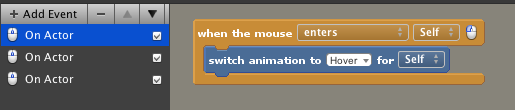
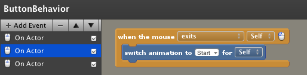
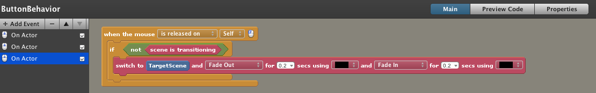
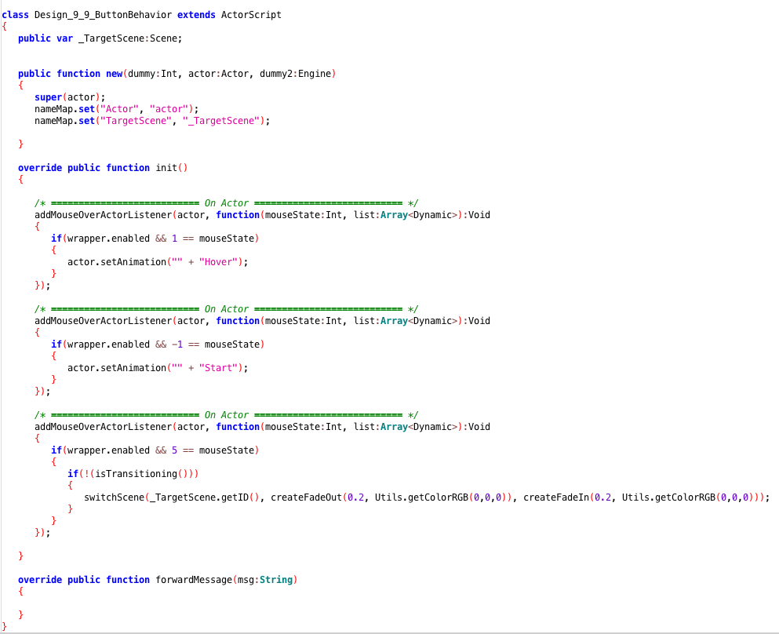
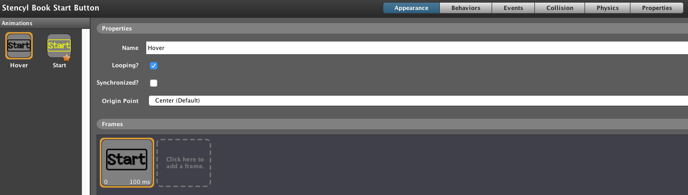

# Game items logic progress

# Sprint progress summary

**1. Button behavior:**

**2. Manu button display**

**3. Background graphics**

**4. Tile sets graphics**

**5. Actor types**

**6. Fonds graphics**

#Scene behavior progress
**7. Scene behaviors display**

**8. Actor behaviors display**

**9. Actors display**

**10. Scene behaviors display**

**11. Tile sets**

**12. Sprint2 play through**

**13. Sprint2 game scenes display**

# Sprint 3 other game items logic progress

**14. Actors display**

**15. Actors collide relationship fixing**

**16. Swordattack behaviors display**

# Sprint 3 other game items logic progress

**17. Actors display**

**18. Actors collide relationship fixing**

**19. Swordattack behaviors display**

**20. Heart behavior display**

**21. Light ball behavior display**

**23. Scene display**

